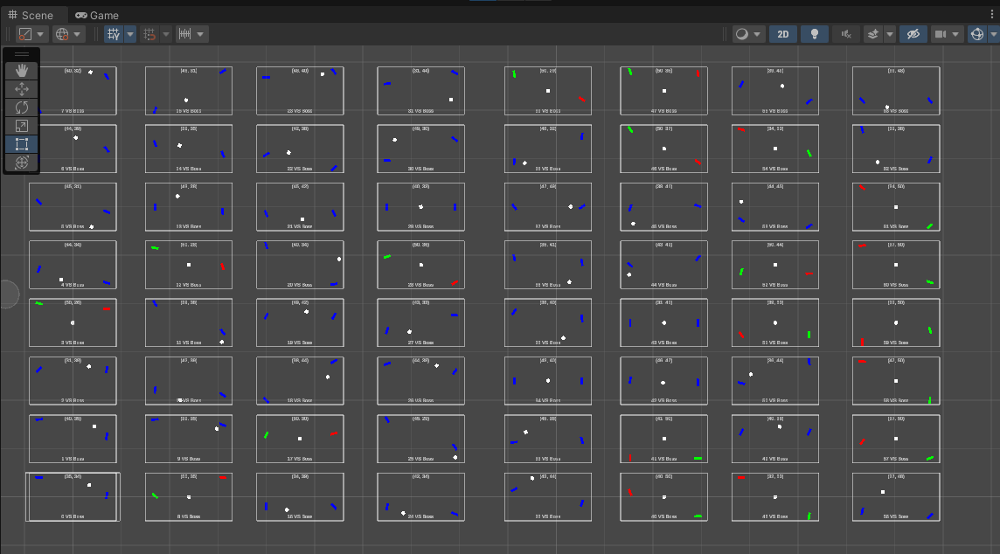

# NeuralPong
Neural network implementation in Unity to play pong.

## Requirements
Unity 6.3

## The neural network
A simple neural network with 4 layers each with 8 'neurons'. Implemented in C# and the inference happens in the CPU.

## The training
The neural network was trained using genetic algorithm mixed in different strategies.\
Every network have it's weights stored in a file in `Assets\StreamingAssets\NNs`.

### Championship
Every network plays against each other once and accumulate points, the winner gets to create the next generation.\
The training setup can be found in the scene `Assets/Scenes/TrainingScene_champ.unity`.

### Vs Bot
Every network plays against a non neural network bot that follows the ball. The winner gets to create the next generation.\
The training setup can be found in the scene `Assets/Scenes/TrainingScene_assisted.unity`.

### Vs Boss
Every network plays against the best network of the previous generation. The winner gets to create the next generation and be it's boss. It is possible that the boss gets to maintain its throne.\
The training setup can be found in the scene `Assets/Scenes/TrainingScene_boss.unity`.

### The result
The best neural network was trained playing agains the bot until he got better than the it. Then it was trained using the Vs Boss strategy.\
You can play agains it in the scene `Assets/Scenes/PlayScene.unity`.

